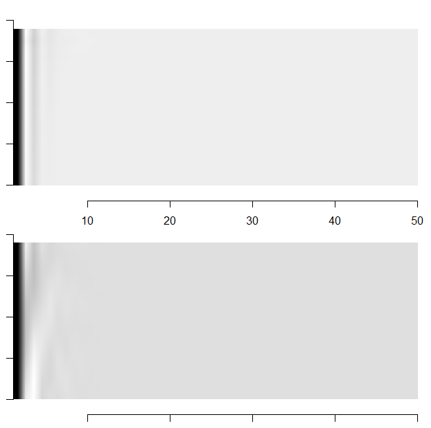

# FluidFlowAnalysis

The data is not mine and it's provided in http://dmdbook.com/
I used SVD decomposition to rule out egien fluid vectors that controls fluid transformation. Here is shown the basic movie of fluid containt in the cylinder.

And then I took rank 10 matrix aproximation svd of fluid amplitude matrix to then reconstruct egien fluids below.

